Membuat DB menggunakan PGadmin4 / membuat database pada postgreSQL

1. Klik Kanan pada servers yang sudah dibuat pilih register->server

   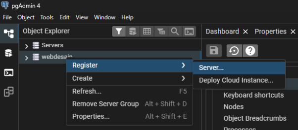

1. Pada tab general tambahkan name semisal webdesain

   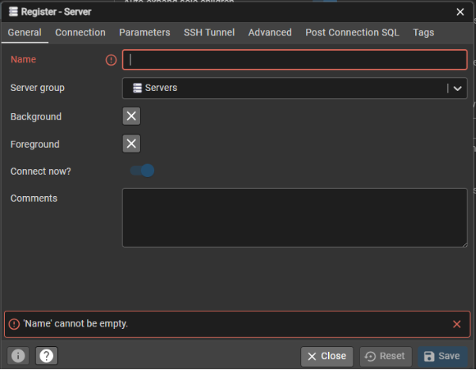

1. Pada hostname/address diisikan alamat host name dalam hal ini menggunakan localhost dan isi juga password.Jika sudah klik save

   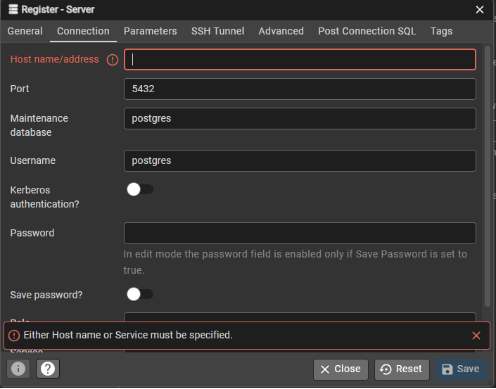

   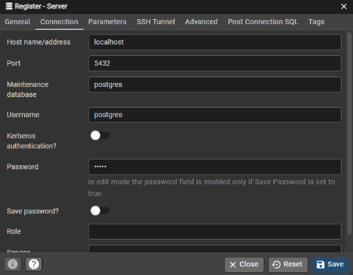

1. Jika berhasil maka tampilannya SBB :

   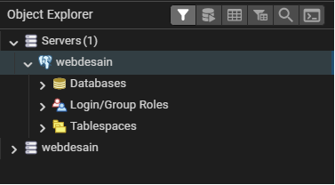

1. Membuat database Klik kanan pada database -> create-> database

   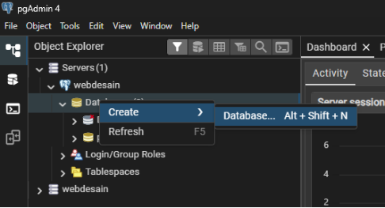

1. Maka akan muncul menu general dan isikan nama databasenya phpdatabase dan simpan

   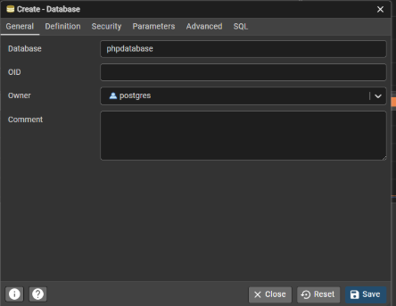

1. Jika berhasil maka tampilannya sebagai berikut

   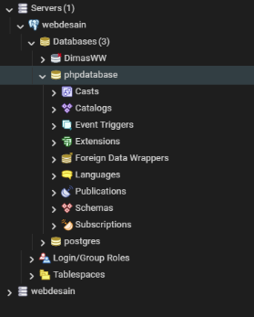

1. Database sudah terbuat maka selanjutnya membuat table. Cari table pada phpdatabase->Schemas-> table

   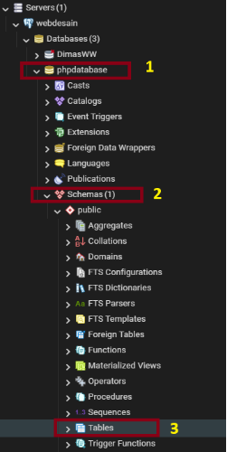

1. Klik kanan pada tabels -> create -> Table

   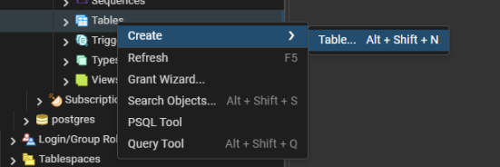

1. Beri nama tabel nya tabel TB\_Mahasiswa

   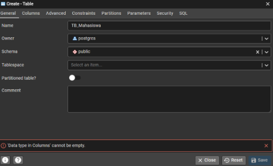

1. Pada collum tambahkan dan save sebagai berikut

   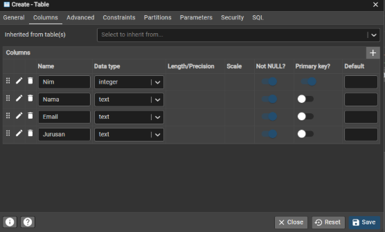

1. Jika berhasil Maka hasilnya seperti berikut 

   

1. Insert data pada pgAdmin4

   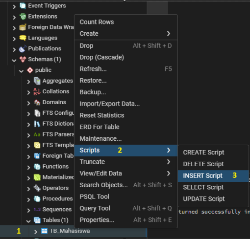

   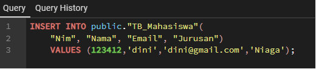

1. Menampilkan data php+pgadmin4+postgreSQL+VSCode, buat file dengan nama index.php

   Tuliskan code sebagai berikut

   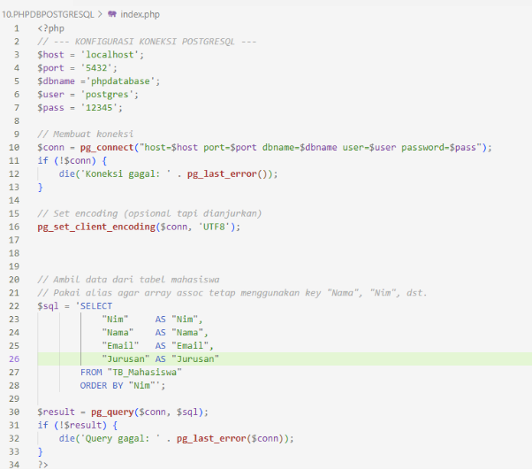

   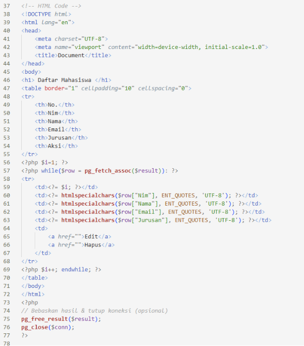

1. Jalankan webserver kalian pastikan sdh ada postgreSQL nya, jika berhasil maka akan muncul sbb

   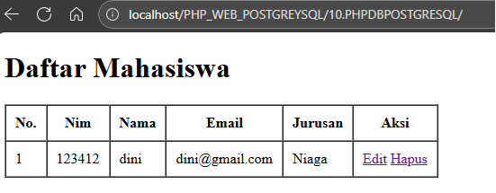

